# 🪑 Exploratory Analysis of Online Furniture Dataset

## 📌 Project Objective
The goal of this project is to analyze online furniture order data to understand:
- Customer behavior  
- Delivery performance  
- Cost impact  
- Payment preferences  

The insights will help improve marketing strategies, operations, and overall customer satisfaction.  

---

## 📊 Dataset Description
- **Rows:** 1,938  
- **Columns:** 14  
- **Data Types:** Categorical & Numerical  

### 🔑 Columns
- `order_id` → Unique ID for each order  
- `customer_id` → Unique ID for each customer  
- `product_category` → Main category (e.g., Bedroom, Kitchen)  
- `product_subcategory` → Specific type (e.g., Sofa, Bed Frame)  
- `brand` → Brand of the product  
- `product_price` → Price (excluding shipping/assembly)  
- `shipping_cost` → Delivery cost  
- `assembly_service_requested` → Whether assembly was requested (True/False)  
- `assembly_cost` → Cost of assembly (if requested)  
- `total_amount` → Final price (product + shipping + assembly)  
- `delivery_window_days` → Expected delivery days  
- `delivery_status` → Delivery outcome (Delivered, Cancelled, Pending, etc.)  
- `payment_method` → Payment type (Credit Card, Apple Pay, etc.)  
- `customer_rating` → Rating given by customer (1–5, with missing values)  

---

## 🛠 Libraries Used
- **Pandas** → Data cleaning & analysis  
- **NumPy** → Numerical operations  
- **Matplotlib & Seaborn** → Data visualization  

---

## 🔎 Exploratory Data Analysis (EDA)

### ✅ Data Cleaning
- Handled missing values (dropped or imputed with mean)  
- Removed duplicates  
- Checked data types and summary statistics  

---

### 📈 Key Insights

#### 1. Product Category Distribution
- Outdoor and Living Room are top-selling categories  
- Dining Room slightly lower in demand  

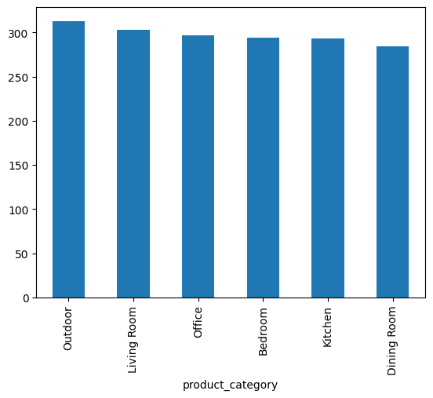

---

#### 2. Top Subcategories
- Bar Carts and Pantry Cabinets lead in demand  
- Seating & storage dominate  

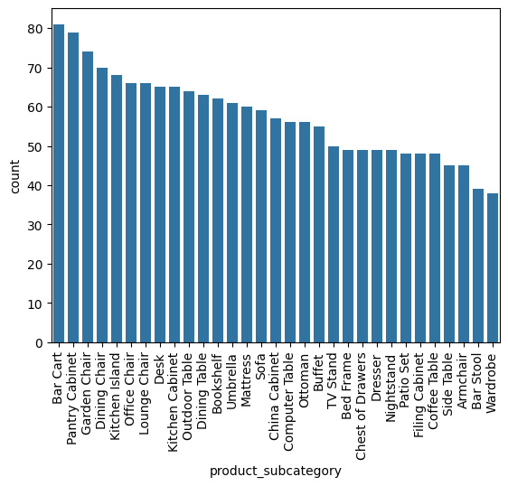

---

#### 3. Payment Methods
- Apple Pay is most popular  
- PayPal is least used  

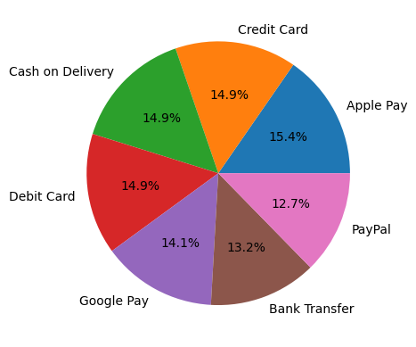

---

#### 4. Total Spend by Category
- Bedroom has the highest spend  
- Office has the lowest  

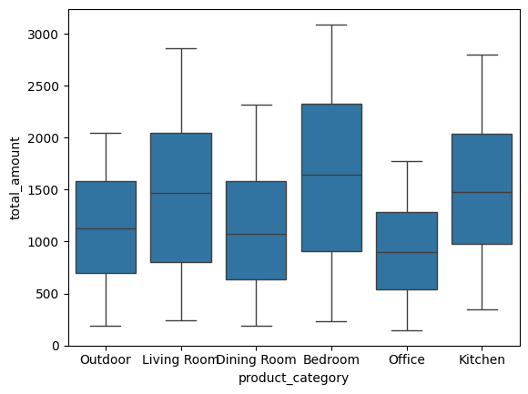

---

#### 5. Customer Ratings
- Most common rating ≈ 3.5  
- Mixed customer experiences  

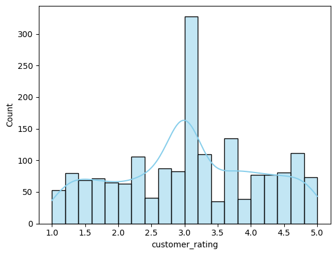

---

#### 6. Top Customers
- Customer `7275` is the highest spender  

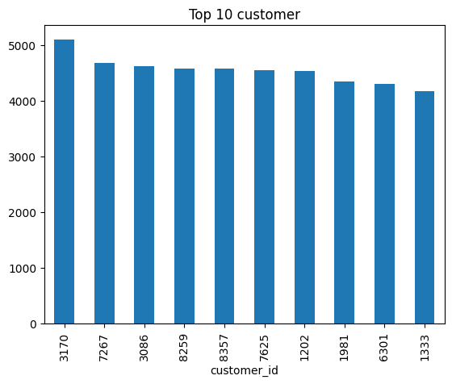

---

#### 7. Price vs. Rating
- No strong correlation  
- Expensive items don’t guarantee higher ratings  

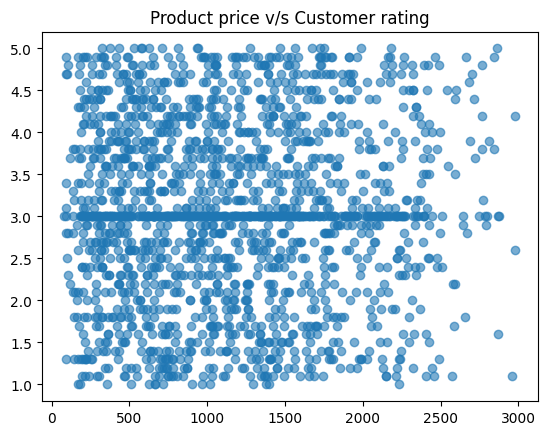

---

#### 8. Delivery Status
- Most orders delivered successfully  
- Some delays, cancellations, and reschedules  

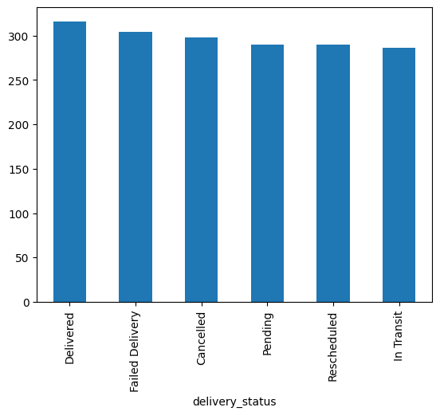

---

#### 9. Brands
- **Most Popular:** Overstock, HomeGoods, World Market  
- **Most Profitable:** Overstock, Ashley Furniture, World Market  

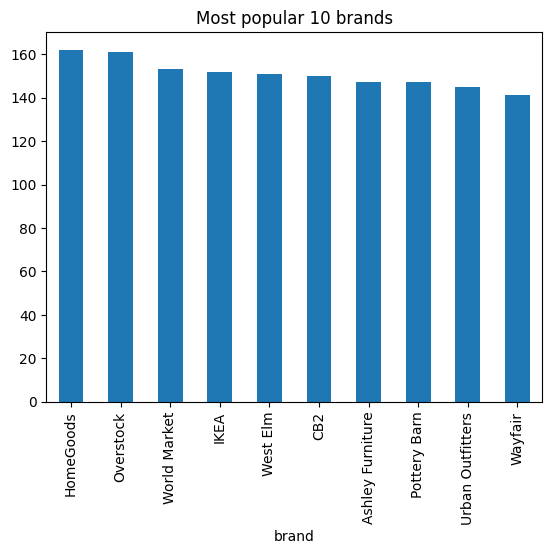  
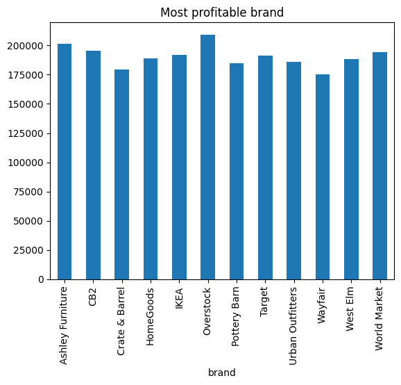

---

#### 10. Assembly Service & Ratings
- Ratings almost same whether assembly requested or not  

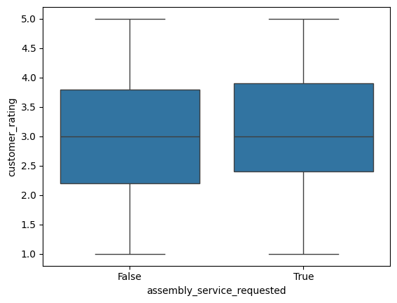

---

#### 11. Price, Shipping & Total Amount
- Product price strongly drives total amount  
- Shipping costs mostly random, often under $150  

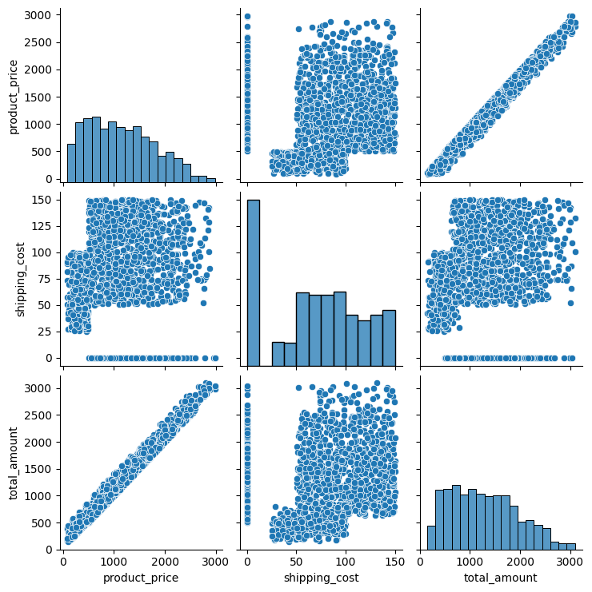

---

## 📝 Conclusion & Recommendations
- **Improve Delivery Performance** → Partner with reliable logistics, offer tracking, flexible slots  
- **Launch Loyalty Programs** → Discounts & rewards for repeat/high-spending customers  
- **Focus on High-Demand & Profitable Products** → Stock Outdoor, Living Room, Bedroom furniture  
- **Strengthen Feedback Process** → Collect more reviews, analyze low ratings  
- **Optimize Assembly Service** → Offer discounts/free trials, consider outsourcing  
- **Streamline Payments** → Highlight Apple Pay, phase out rarely used methods like PayPal  
- **Enhance Transparency** → Better images, detailed descriptions, verified reviews  
- **Personalize Marketing** → Use behavioral segmentation for targeted campaigns  
